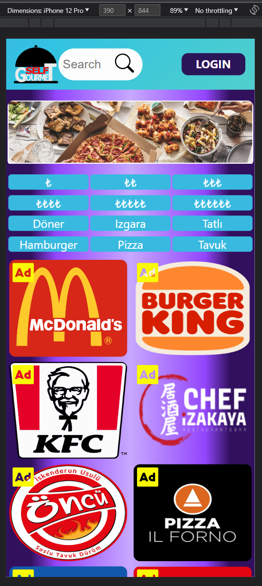

# SELFGOURMET.COM
## webapp-firt-try-basedon-pern-stack

Dışardan yemek söylemeyi tercih eden biri olarak restoranların online sipariş platformlarındaki fiyat farkını ve bu fiyatları karşılaştıracak bir site olmadığını fark  ettim(örneğin cimri.com gibi).
Fiyat farkı rekabet ortamı yaratmak için bunun gibi bir siteye ihtiyaç olduğunu düşünüyorum.

Full Stack PERN Çalışmam

- Database: PostgreSQL
- Backend: NodeJS/Express Server
- Frontend: ReactJS

Kullanmış olduğum önemli paketler

- Styled Component
- Knex (for Postgres)
- JWT/bcryptjs (Json Web Token)
- Redux
- Axios
- React-Router (artık react ile varsayılan)
- React-Toastify

Ek olarak uygulamayı sunmak için bir vps' de deploy ettim. (1 aylık server 15/06/23 itibari ile kapandı)

- HostingerVPS
- Linux(Ubuntu)
- NGINX
- NodeJS

> Yeni vps alındıktan sonra tekrar subdomain altında live olacaktır.

***Gazi Üniversitesi Teknoloji Fakültesi Bilgisayar Mühendisliği proje ödevidir kurumlar, fiyatlar ve yorumlar gerçeği yansıtmaz.***

- Projeden istenenler;
  - Proje Yönetimi
  - Verilen rapordaki isterlerin yerine getirilmesi (kod ve kullanılan teknolojilere bakılmaksızın)

### Login Page

> Reklam Çeviren Otomatik Slaytlı Giriş Ekranı

> Giriş Ekranı Mobil ve Responsive Görünümü (slayt alanı belli bir pixele kadar yeniden boyutlandırılır)

### Home Page

> Anasayfa (Hızlı Arama Butonları ve Reklam Vitrini) (normalde banner slayt olacaktı ama uygun görsel bulunamadı)

> Anasayfa Mobil Görünümü (isterlerde olmamasına rağmen birkaç sayfa mobil veya responsive tasarlandı)

> Animasyonlu Kullanıcı Popup Menüsü

### List Page

> Tüm Restoranlar veya Aranan Restoranlar Listelenir (listelenenler üzerinden en çok kullanılan platformalara direk yönlendirme sağlanır (örneğin Yemeksepeti))

> Filtreleme Sistemi Sonucu Listelenir

### Partner Page

> Yorum Sekmesi (En beğenilen, En Son, Cevaplanan olarak sekmelenir)

> Animasyonlu Gizlenir Yorum Yazma Butonu

> Kampanyalar Sekmesi (isterlerde yoktu eklemeyi düşündüm ama yarım kaldı)

> Menü Sekmesi

> Bir Menünün Açılımı (ucuzdan pahalıya tüm platformları fiyatlarıyla birlikte gösterir ve tıklanınca siteye yönlendirir, eğer admin, mod, ya da mağaza sahibi ise kullanıcı en sona hazır platform ekleme modülü ekler)

> Yorum Yazma Penceresi

> Animasyonlu Gizlenir Menü Ekleme Butonu (sadece admin, mod ve mağaza sahibi tarafından görüntülenir)

> Menü Ekleme Penceresi

> Hazır Platform Ekleme Modülü (sadece admin, mod ve mağaza sahibi tarafından görüntülenir)

### Profile Page

> Profil Sayfası (sol tarafta kullanıcı fotoğrafı ve bilgileri sağda kullanıcı işlem butonları (aktif değil))

### Not Found Page (404)

> Not Found Page (yönlendirme URL'leri hariç tüm URL'ler bu adrese yönlendirilir)

_Not: Navbar arkaplanı renk geçiş animasyonludur. Bu yüzden erkan görüntülerinde farklı renkle çıkmıştır._
